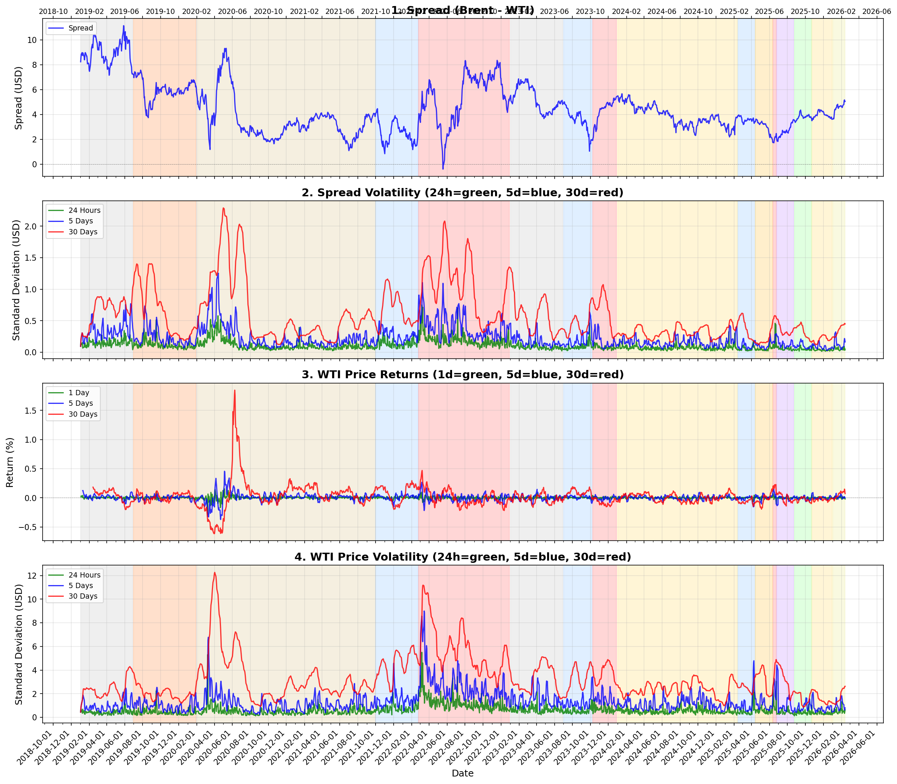
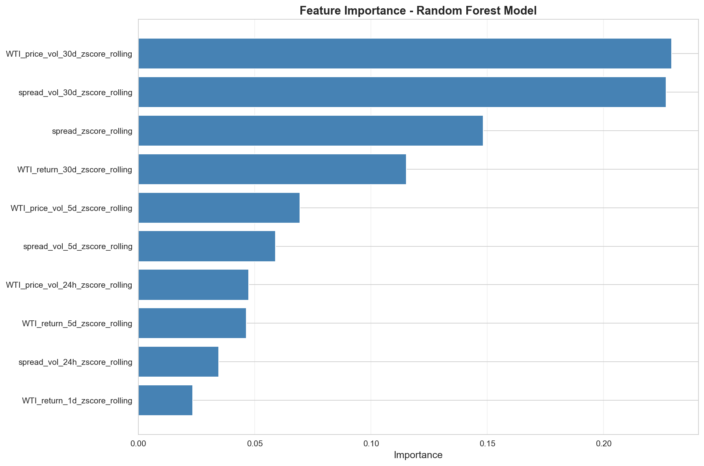

# Oil Market Geopolitical Risk Analysis

This project analyzes the relationship between oil market features (Brent-WTI spread, volatility, returns) and geopolitical periods. It uses machine learning to assess the risk of pre-war conditions based on market patterns.

## Overview

We analyze how oil market conditions change during different geopolitical periods (normal times, pre-war, war, post-war) and use this to assess risk for future periods.

**Key Hypothesis**: During 2024, I hypothesized that if a relatively large-scale war happens involving Iran, it should affect not only the oil price but also the spread between WTI and Brent prices, as war in the Persian Gulf should add some premium for WTI, so the spread should shrink. Later I also added volatility to this hypothesis, as these features also show less certainty and more risk. The final analysis includes both spread and price returns and their volatility. 

## Notebooks

### 📊 Notebook 1: `01_analysis.ipynb` - Data Preparation and Exploration

**Purpose**: Downloads data, creates features, and explores patterns across geopolitical periods.

**Key Sections**:
1. **Data Download** (Cell 1): Downloads hourly Brent/WTI prices from OANDA API from 2019-01-01 onwards (requires `.env` with API credentials)
2. **Feature Engineering** (Cell 2): Creates 10 features:
   - Spread (Brent - WTI) and its volatility (24h, 5d, 30d)
   - WTI price returns (1d, 5d, 30d) and volatility (24h, 5d, 30d)
3. **Comprehensive Labeling** (Cell 2): Assigns geopolitical labels based on historical events:
   - **Training Data (2024-2025)**: Iran-related war periods (Pre-War Early/Close, War, Post-War Close/Late, Normal-Tense)
   - **Test Data**: Multiple disjoint periods for validation:
     - Normal (2019 H1, 2023 H1) - baseline periods
     - 2019-Tension - Iran-Saudi escalation (tanker attacks, Saudi refinery attack, Soleimani killing)
     - Normal-COVID (2020-2021) - COVID impact period
     - Russia-Ukraine-Pre-War (2021-10 to 2022-02-23) - pre-war buildup
     - Russia-Ukraine-War (2022-02-24 to 2022-12-31) - war period (truncated as market normalized)
     - Israel-Hamas-Pre-War (2023-07 to 2023-10-06) - pre-war buildup
     - Israel-Hamas-War (2023-10-07 to 2023-12-31) - war period (truncated as market normalized)
     - Unlabeled (2026+) - future test data
4. **Z-Score Calculation** (Cell 4): Standardizes features (rolling and global z-scores) for comparison
5. **Visualizations** (Cells 3, 5-8): Time series and scatter plots showing patterns by period
6. **PCA** (Cell 8): Dimensionality reduction to identify main patterns
7. **Data Export** (Cell 9): Saves processed data for machine learning

**Key Concepts**:
- **Z-Scores**: Standardized values showing how many standard deviations a feature is from average
- **Rolling Z-Score**: Compares to recent 30-day average (captures short-term deviations)
- **Global Z-Score**: Compares to entire dataset average (captures long-term deviations)

---

### 🤖 Notebook 2: `02_simple_model.ipynb` - Risk Assessment

**Purpose**: Trains ML models and assesses geopolitical risk across multiple historical and future periods.

**Key Sections**:
1. **Data Preparation** (Cell 2): Splits data into training (2024-2025 Iran-related periods) and multiple disjoint test sets (2019-2023 historical periods, 2026+ future)
2. **Model Training** (Cell 3): Trains Random Forest, Logistic Regression, and SVM on 2024-2025 data using rolling z-scores
3. **Confusion Matrices** (Cells 4-5): Evaluates model performance on training and all test sets (with label mapping for different war types)
4. **Predictions** (Cell 6): Predicts labels for all test periods using all models, with separate visualizations for key periods
5. **Mahalanobis Distance** (Cell 7): Measures anomaly using Normal-Tense baseline, includes:
   - Baseline (Normal-Tense from training)
   - Recent normal periods (2019 H1, 2023 H1) for comparison
   - All Iran war periods, historical wars, and 2026 data
   - Box plots and time series visualizations
6. **Pre-War/War Risk** (Cell 8): Calculates probabilities for pre-war and war states across all models
7. **Combined Risk** (Cell 8): Unified risk score combining normalized Mahalanobis distance + geopolitical risk (pre-war/war probabilities)
8. **Additional Insights** (Cell 10): Model agreement, feature contributions, risk trends, correlations
9. **2026 Comprehensive Assessment** (Cell 11): Detailed analysis of 2026 unlabeled data with all risk indicators

**Key Concepts**:
- **Pre-War Risk Probability**: ML model's estimate of pre-war likelihood (0-100%)
- **Mahalanobis Distance**: Statistical measure of anomaly from "normal" baseline
- **Combined Risk Score**: Average of normalized Mahalanobis + pre-war probability
- **Model Agreement**: How often all models predict the same label (higher = more confident)

---

## Visualizations

The notebooks generate numerous visualizations showing patterns, predictions, and risk assessments. Here are a few examples:

### Feature Patterns Over Time

*Time series showing how market features (spread, volatility, returns) change across different geopolitical periods. Background colors indicate different periods (Normal, Pre-War, War, Post-War).*

### Model Feature Importance

*Random Forest model showing which features are most important for predicting geopolitical periods. Higher values indicate features that drive predictions more.*

**Note**: More visualizations are available in the `images/` folder, including:
- Scatter plots showing relationships between features
- PCA visualizations of principal components
- Risk assessment charts (pre-war probability, Mahalanobis distance, combined risk)
- Model agreement and trend analyses
- Comparisons between pre-war periods and current data

All visualizations are automatically generated when you run the notebooks. The notebooks contain many more charts and plots that help understand the data and model predictions.

---

## Key Concepts and Meanings

### Risk Indicators Explained

1. **Pre-War Risk Probability** (0-100%)
   - **What it is**: ML models' estimate that current market conditions match pre-war patterns
   - **How calculated**: Sum of "Pre-War Early" + "Pre-War Close" probabilities from all models, taking the maximum (conservative)
   - **What it means**: Higher values = models see features similar to historical pre-war periods
   - **Limitation**: Based on patterns learned from 2024-2025, may not generalize perfectly

2. **Mahalanobis Distance** (0 to ∞)
   - **What it is**: Statistical measure of how "unusual" current conditions are
   - **How calculated**: Distance from "Normal-Tense" baseline (2024-2025 training period) using global z-scores
   - **What it means**: Higher = more anomalous/unusual market behavior compared to the baseline regime
   - **Why useful**: Catches anomalies that models might miss (complementary signal)
   - **Important**: Different normal periods (2019, 2023) show divergence from baseline, indicating regime changes

3. **Combined Risk Score** (0-100%)
   - **What it is**: Unified risk indicator combining both anomaly and prediction signals
   - **How calculated**: Average of (normalized Mahalanobis distance + pre-war probability)
   - **What it means**: Higher = both statistical anomaly AND model prediction agree on risk
   - **Best use**: When both indicators are high, risk signal is stronger

### Important Distinctions

- **Risk Assessment vs. Prediction**: This tool assesses risk based on patterns, not a crystal ball
- **Pattern-Based**: Models learn from 2024-2025 labeled data; 2026 is unlabeled test data
- **Complementary Signals**: Mahalanobis (statistical anomaly) and pre-war probability (learned patterns) measure different aspects
- **Negative Correlation**: The two indicators often disagree, which is expected - they capture different types of risk signals

---

## Key Observations and Conclusions

### What the Analysis Shows

1. **Regime Changes Cause Baseline Divergence**
   - Different "normal" periods (2019 H1, 2023 H1) show significant divergence from the training baseline (Normal-Tense from 2024-2025)
   - This indicates **market regime changes over time** - what was "normal" in one period differs from another
   - COVID, Ukraine war, and Gaza war gradually shifted the market's definition of "normal" over time
   - The baseline (Normal-Tense) represents a specific regime, and historical normals from different regimes appear anomalous

2. **Anomalies Detected for Both War and Pre-War Periods**
   - Both main war periods (Iran-related, Russia-Ukraine, Israel-Hamas) and pre-war periods show elevated Mahalanobis distances
   - This confirms that **both war and pre-war conditions are statistically anomalous** compared to stable periods
   - Pre-war periods often show similar anomaly levels to war periods, suggesting market anticipation
   - Main features also show the same pattern after z-score normalization (spread tightens, volatility increases, etc.) 

3. **2019-Tension Period: A "Slow War" Interrupted by COVID**
   - The 2019-Tension period (Iran-Saudi escalation: tanker attacks, Saudi refinery attack, Soleimani killing) shows **similar anomaly patterns to pre-war periods**
   - This suggests it may have been a "slow war" or pre-war period that was **interrupted by COVID** in early 2020
   - Market conditions during this period were building toward conflict but normalized due to the pandemic disruption

4. **Market Normalization of Prolonged Conflicts**
   - For Russia-Ukraine and Gaza wars, we **truncated the war periods** (only showing first ~10 months) because:
     - Both conflicts are ongoing and became too long
     - **Markets appear to normalize prolonged conflicts** - after initial shock, conditions return closer to baseline
     - This suggests markets adapt to "new normal" even during ongoing conflicts
   - The truncated periods capture the initial war shock, which is most relevant for risk assessment

5. **Pattern Recognition Works Across Different War Types**
   - Models trained on Iran-related periods (2024-2025) can identify similar patterns in other conflicts (Russia-Ukraine, Israel-Hamas)
   - This suggests **common market signatures** exist across different geopolitical conflicts
   - Pre-war patterns are particularly consistent across different conflict types

6. **Models and Anomaly Detection Provide Complementary Signals**
   - Negative correlation between Mahalanobis and pre-war probability suggests they measure different aspects
   - Mahalanobis captures **statistical deviation** from baseline regime
   - Model predictions capture **learned patterns** from training data
   - Combined risk score integrates both perspectives for more robust assessment

7. **Feature Relationships and Importance**
   - Spread, volatility, and returns all show distinct patterns across geopolitical periods
   - Feature importance analysis reveals which features drive predictions most
   - WTI price volatility (especially 30-day) and spread volatility are key indicators

### Limitations and Caveats

- **Regime-Specific Baseline**: Mahalanobis distance uses Normal-Tense (2024-2025) as baseline, which represents a specific market regime. Historical normals from different regimes (2019, 2023) appear anomalous due to regime shifts.
- **Not Perfect Prediction**: Models trained on 2024-2025 Iran-related periods may not capture all future scenarios or different conflict types perfectly
- **Limited Training Data**: War period is small (10 days), making it harder to learn war-specific patterns
- **2026 is Unlabeled**: We can't verify if predictions are correct (no ground truth yet)
- **Pattern-Based**: Relationship exists but may not be causal or deterministic
- **Market Adaptation**: Prolonged conflicts show market normalization over time, so only initial periods are most relevant for risk assessment
- **Multiple Regimes**: Market has shifted through multiple regimes (pre-COVID, COVID, post-COVID, post-Ukraine), making cross-regime comparisons complex

### Practical Value

Despite limitations, this analysis provides:
- **Early Warning System**: Identifies when market conditions deviate from normal
- **Risk Quantification**: Provides numerical risk scores for decision-making
- **Pattern Recognition**: Confirms relationships between market features and geopolitical periods
- **Multi-Signal Approach**: Combines statistical anomaly detection with ML pattern recognition

**Bottom Line**: While not a perfect predictor, this framework provides a useful risk assessment tool that identifies when market conditions suggest elevated geopolitical risk based on learned patterns and statistical anomalies.

## Quick Start

1. **Setup**: Create `.env` file with `OANDA_API_KEY` and `OANDA_ACCOUNT_ID`
2. **Run Notebook 1**: Downloads data, creates features, saves processed data
3. **Run Notebook 2**: Trains models, makes predictions, assesses risk

## Interpreting Results

- **Pre-War Risk > 50%**: Models see strong pre-war pattern match
- **Mahalanobis > 95th percentile**: Market conditions are highly unusual
- **Combined Risk > 50%**: Both signals agree on elevated risk
- **Trend Analysis**: Check if risk is increasing (building up) or decreasing

## Requirements

- Python 3.11+
- pandas, numpy, matplotlib, seaborn
- scikit-learn, scipy
- python-dotenv, requests
- OANDA API credentials

## Output

The notebooks produce:
- Processed data files
- Visualizations of features and predictions
- Risk assessments for 2026 data
- Statistical comparisons and insights

All results are displayed in the notebooks and saved to the `data/` directory.
